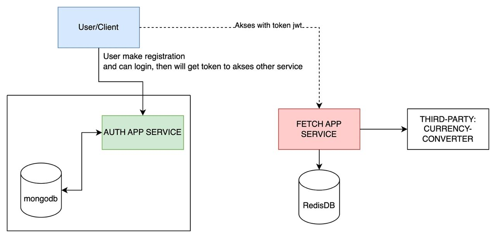

# Project Title

Efishery BACKEND ENGINEER TASK

### Prerequisites

What things you need to install the software and how to install them

```
Golang
Nodejs
Docker
....
```

### Installing

- Create ENV file (.env) with this configuration in each project:
```
PORT=
BASIC_AUTH_USERNAME=
BASIC_AUTH_PASSWORD=
PUBLIC_KEY_PATH=
PRIVATE_KEY_PATH=
MONGO_DATABASE_URL=
```
- Or you can, rename .env.example to .env
- Then run this command
```
Run using docker
...
$ docker-compose up
```

### RUNNING GO PROJECT
```
- assuming your laptop already has Go 1.17 or higher installed
- Rename .env.example to .env
- Run Use command make
...
$ make run
```
- If found error, please download lib
...
$ go mod download
```
...
$ go mod tidy
```
- please run again
...
$ make run 

### RUNNING NodeJS PROJECT
```
- assuming your laptop already has NodeJS 14 or higher installed
- Rename .env.example to .env
- Download depency and Start app
...
$ npm i
$ npm run start
```

### C4 Diagram



### Built With

* [Echo] The Golang rest framework used
* [Restify] The Nodejs rest framework used
* [Npm] - Dependency Management
* [Docker] - Container Management

### Authors

* **farid tri wicaksono** - *Initial work* - [Github](https://github.com/farid-alfernass)

### Documentation

* see (https://documenter.getpostman.com/view/10198024/2s93m1Yj7R)
